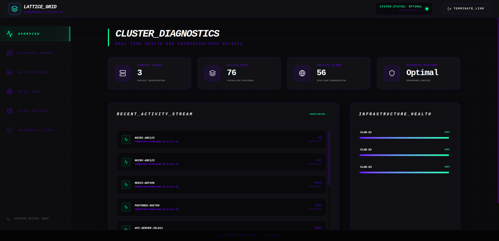
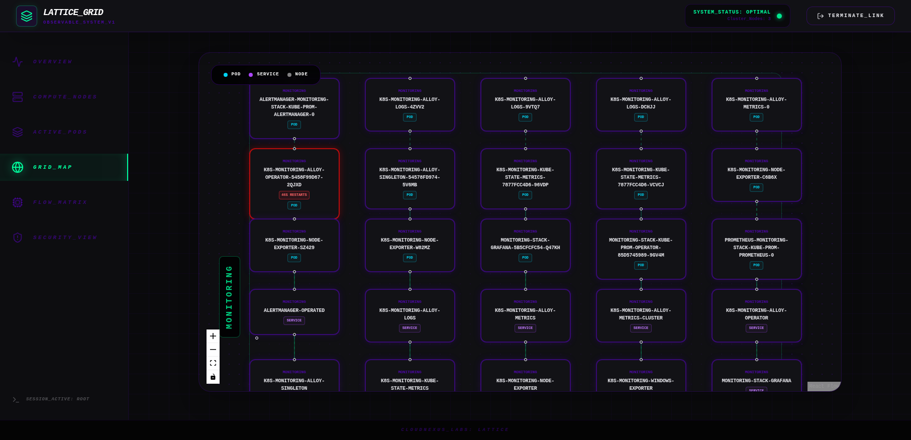
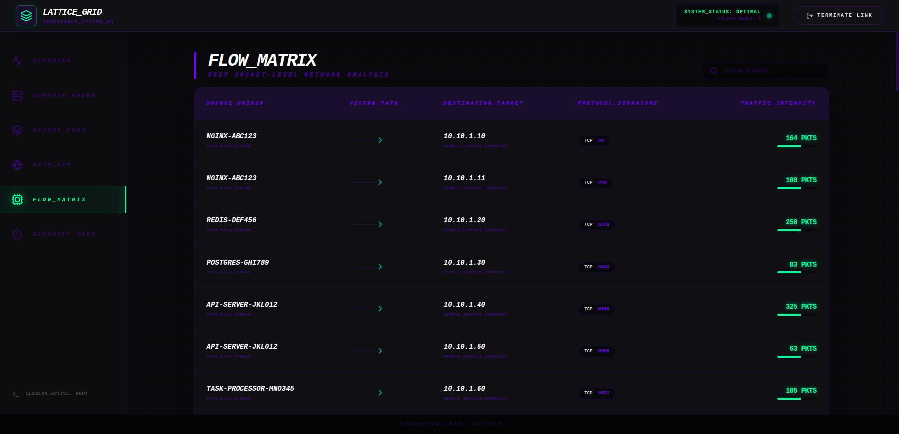
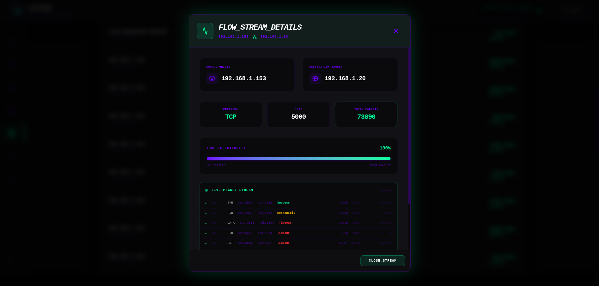
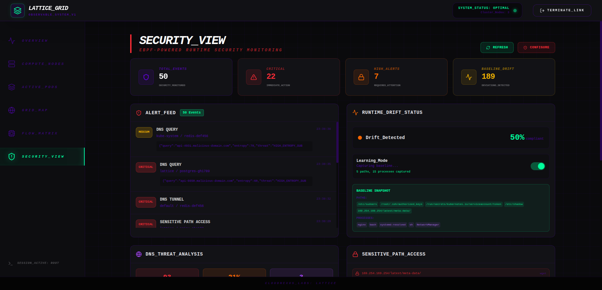
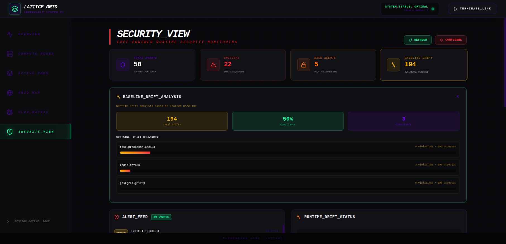
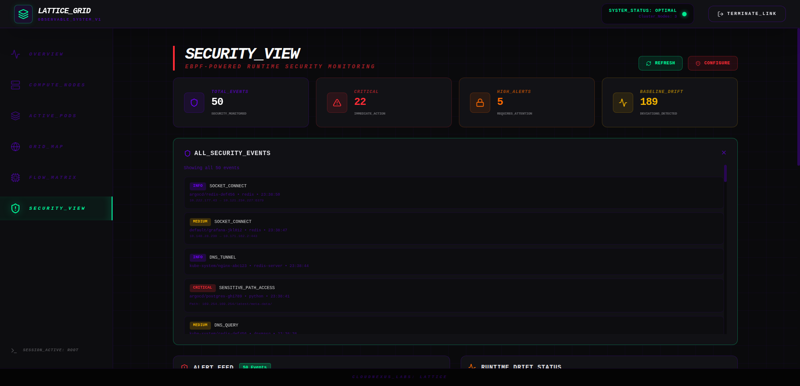

# Lattice - Kubernetes Observability Platform

A modern, scalable Kubernetes observability platform powered by eBPF that provides real-time insights into cluster health, network flows, pod status, and runtime security monitoring.



---

## Changelog

### Latest Changes (v1.1.7+)

#### Bug Fixes
- **Flow Matrix Live Packet Capture**: Fixed issue where flows with high packet counts (e.g., 17000+ pkts) showed "Awaiting packet capture..." instead of live packet stream
  - **Root Cause**: Inconsistent flow key format between seed flows (`{dest}:{port}`) and agent-reported flows (`{src}:{port}`)
  - **Fix**: Backend `/api/report-flow` now uses consistent key format `{dest}:{port}` for flow aggregation
  - **Impact**: All flows now properly aggregate and display live packet streams

#### Features
- **Live Packet Stream Details**: Click on any flow to view real-time packet capture including:
  - Packet type (SYN, ACK, PSH, FIN, RST, DATA)
  - Sequence/acknowledgment numbers
  - Status (Success, Retransmit, Timeout)
  - Payload size and latency
  - Protocol (TLSv1.3, HTTP/1.1, HTTP/2, QUIC)
- **Enhanced Flow Tracking**: Agent-reported flows now properly aggregate with seed flows

#### Version Information
| Component | Version |
|-----------|---------|
| Frontend | v1.1.28 |
| Backend | v1.1.7 |
| Agent | v1.0.7 |

---

## Table of Contents

- [Changelog](#changelog)
  - [Latest Changes (v1.1.7+)](#latest-changes-v117)
- [Features](#features)
  - [Overview Dashboard](#overview-dashboard)
  - [Grid Map (Topology View)](#grid-map-topology-view)
  - [Flow Matrix](#flow-matrix)
  - [Security View](#security-view)
- [Architecture](#architecture)
- [Components](#components)
- [Deployment](#deployment)
- [API Endpoints](#api-endpoints)
- [Security Features](#security-features)
- [Tech Stack](#tech-stack)
- [Project Structure](#project-structure)
- [Screenshots Reference](#screenshots-reference)

---

## Features

### Overview Dashboard

The Overview Dashboard provides a high-level summary of your Kubernetes cluster's health and activity:


**Key Metrics:**
- **Cluster Nodes** - Number of physical/virtual nodes in the cluster
- **Active Pods** - Total count of running pods across all namespaces
- **Traffic Flows** - Number of active network connections being monitored
- **Security Posture** - Overall security status (Optimal/Degraded/Critical)

**Components:**
- **Recent Activity Stream** - Live feed of network connections with source/destination details
- **Infrastructure Health** - Per-node health indicators with resource usage percentages

**Interactive Features:**
- Click on any metric card to see detailed breakdowns
- Real-time updates every 5 seconds
- Node health visualization with percentage indicators

---

### Grid Map (Topology View)

A visual representation of your entire Kubernetes cluster organized by namespace:



**Features:**
- **Namespace-based grouping** - Pods organized into collapsible namespace sections
- **Pod visualization** - Each pod displayed as a card with name and type
- **Node mapping** - Visual connections showing pod-to-node relationships
- **Service awareness** - Different visual styling for:
  - **Pods** - Standard container workloads
  - **Services** - Kubernetes service abstractions
  - **Nodes** - Physical/virtual cluster nodes

**Restart Detection:**
Pods with high restart counts are automatically highlighted:
- **Red border intensity** scales with restart count severity
- **"X RESTARTS" badge** displayed on affected pods
- Restarts fetched from Kubernetes container status metrics

**Use Cases:**
- Identify crashing applications quickly
- Spot misconfigured pods
- Detect resource constraint issues
- Monitor rolling update progress

**Interactive Features:**
- Zoom in/out controls
- Fit-to-view button
- Toggle interactivity for screenshots
- Animated edges showing pod-to-node relationships

---

### Flow Matrix

Deep socket-level network analysis showing all TCP/UDP connections:



**Table Columns:**
- **Source Origin** - Pod name initiating the connection
- **Vector Path** - Connection type indicator (IPV4_DATA_STREAM)
- **Destination Target** - Target IP address
- **Protocol Signature** - Protocol (TCP/UDP) and port
- **Traffic Intensity** - Packet count for the connection

**Features:**
- Real-time traffic flow monitoring
- Source and destination visualization
- Protocol and port tracking
- Traffic intensity metrics (packet counts)
- Filter input for searching specific flows
- **Live Packet Stream** - Click on any flow to view real-time packet details

**Live Packet Stream Details:**
When you click on a flow, a detailed panel opens showing:



- **Flow Header** - Source and destination IP addresses with connection arrow
- **Flow Metadata** - Protocol, port, and total packet count
- **Traffic Intensity Gauge** - Visual representation of flow activity
- **Live Packet Stream** - Real-time packet capture with:
  - Packet type (SYN, ACK, PSH, FIN, RST, DATA)
  - Sequence and acknowledgment numbers
  - Status indicators (Success, Retransmit, Timeout)
  - Payload size and latency
  - Protocol information (TLSv1.3, HTTP/1.1, HTTP/2, QUIC)
- **Last Seen** - Timestamp of most recent activity

The live packet stream auto-refreshes every 2 seconds, providing real-time visibility into network communications.

**Columns Explained:**
| Column | Description |
|--------|-------------|
| Source Origin | The pod or service generating traffic |
| Vector Path | Network path type (IPv4/IPv6, stream type) |
| Destination Target | Remote IP endpoint |
| Protocol Signature | L4 protocol and port number |
| Traffic Intensity | Total packets transferred |

---

### Security View

eBPF-powered runtime security monitoring with intelligent threat detection:



#### Dashboard Overview

The Security View provides four clickable stat cards at the top:

| Stat Card | Description | Color |
|-----------|-------------|-------|
| **Total Events** | Total security events captured | Cyan |
| **Critical** | Critical severity alerts | Red |
| **High Alerts** | High severity alerts | Orange |
| **Baseline Drift** | Deviation from learned baseline | Yellow |

#### Alert Feed

The main event stream showing real-time security events with severity-based styling:

**Severity Levels:**
- **CRITICAL** (Red) - Immediate action required
- **HIGH** (Orange) - Requires attention soon
- **MEDIUM** (Yellow) - Should be investigated
- **LOW** (Gray) - Informational
- **INFO** (Gray) - Debugging information

**Event Types:**
- `SOCKET_CONNECT` - Network connection tracking
- `DNS_QUERY` - DNS query monitoring
- `DNS_TUNNEL` - Potential DNS tunneling detection
- `SENSITIVE_PATH_ACCESS` - Access to sensitive files
- `BASELINE_DRIFT` - Deviation from learned baseline

#### Runtime Drift Status

The **Learning Mode** feature captures baseline behavior:

1. Enable the toggle to start learning
2. System captures paths and processes during learning
3. New events compared against learned baseline
4. Deviations flagged as "Baseline Drift"

**Baseline Snapshot Panel:**
When learning is enabled, shows captured:
- **Paths** - File paths accessed by processes
- **Processes** - Process names (comm) observed



#### DNS Threat Analysis

Detects suspicious DNS activity:

**Metrics:**
- **High Entropy** - Count of high-entropy subdomain queries (potential DGA)
- **NXDOMAIN Rate** - Percentage of non-existent domain lookups
- **Suspicious TLDs** - Queries to suspicious top-level domains

**Event Details:**
- Entropy score per query
- Full domain name
- Threat classification (HIGH_ENTROPY_SUBDOMAIN, etc.)

#### Sensitive Path Access Monitoring

Alerts for access to critical files and cloud metadata:

**Monitored Paths:**
- `/etc/shadow` - Password file
- `/etc/sudoers` - Sudo configuration
- `/root/.ssh/authorized_keys` - SSH keys
- `/run/secrets/` - Kubernetes secrets
- `169.254.169.254/*` - Cloud metadata service

#### Clickable Security Stats

All four stat cards reveal detailed views when clicked:

**Total Events Detail:**


Shows all security events with:
- Event type and severity
- Namespace/pod information
- Process name (comm)
- Timestamp
- Additional details (paths, IPs, ports)

**Baseline Drift Detail:**


Shows:
- Total drift count
- Compliance percentage
- Container count
- Per-container drift breakdown with visual progress bars

#### Security Modules Overview

Status indicators for all security monitoring components:
- Socket-to-Process correlation
- Runtime Drift Detection
- DNS Threat Monitoring
- Sensitive Path Access

---

## Architecture

```
┌─────────────────────────────────────────────────────────────┐
│                     React Frontend                           │
│                   (lattice-frontend)                        │
│              Port 80 (nginx)                                │
└─────────────────────┬───────────────────────────────────────┘
                      │ HTTP API (/api/*)
                      ▼
┌─────────────────────────────────────────────────────────────┐
│                   FastAPI Backend                           │
│                    (lattice-backend)                       │
│                     Port 8000                               │
│  ┌──────────────┬──────────────┬──────────────────────┐    │
│  │   Auth       │  K8s API    │   Security Events   │    │
│  │   (JWT)      │  (cluster)  │   + Baseline        │    │
│  │              │              │   Learning          │    │
│  └──────────────┴──────────────┴──────────────────────┘    │
└─────────────────────┬───────────────────────────────────────┘
                      │
      ┌───────────────┼───────────────┐
      ▼               ▼               ▼
┌─────────────┐ ┌─────────────┐ ┌─────────────┐
│ Kubernetes  │ │ PostgreSQL  │ │   eBPF      │
│   API       │ │  Database   │ │   Agent     │
│  (cluster)  │ │ (lattice-db)│ │ (DaemonSet) │
└─────────────┘ └─────────────┘ └─────────────┘
```

**Data Flow:**
1. Agents collect network/security data via eBPF
2. Data sent to backend via authenticated API
3. Backend stores in PostgreSQL and serves via REST API
4. Frontend displays real-time updates via polling

---

## Components

| Component | Description | Type |
|----------|-------------|------|
| **lattice-frontend** | React SPA with cyberpunk UI | Web Application |
| **lattice-backend** | FastAPI REST API server | Backend Service |
| **lattice-db** | PostgreSQL for data storage | Database |
| **lattice-agent** | eBPF-based monitoring DaemonSet | Kubernetes DaemonSet |

---

## Deployment

Deploy the entire stack to the `lattice` namespace:

```bash
# Using the included Helm chart
helm install lattice ./helm/lattice --namespace lattice --create-namespace

# Or use the convenience script
./helm/install.sh
```

### Prerequisites

- Kubernetes cluster (1.20+)
- Helm 3.x
- Docker registry for images (default: `192.168.1.20:5000`)

### Configuration

Key values in `helm/lattice/values.yaml`:

```yaml
backend:
  image: 192.168.1.20:5000/lattice-backend:v1.1.7

frontend:
  image: 192.168.1.20:5000/lattice-frontend:v1.1.28

agent:
  image: 192.168.1.20:5000/lattice-agent:v1.0.7

namespace: lattice
```

### Access the Dashboard

```bash
kubectl port-forward svc/lattice-frontend 8080:80 -n lattice
```

Then open http://localhost:8080 in your browser.

**Default Credentials:**
- Username: `admin`
- Password: `change-me-admin`

---

## API Endpoints

### Authentication
| Endpoint | Method | Description |
|----------|--------|-------------|
| `/token` | POST | Authenticate with username/password, returns JWT |

### Topology & Network
| Endpoint | Method | Description |
|----------|--------|-------------|
| `/api/topology` | GET | Cluster topology (pods, services, nodes) |
| `/api/flows` | GET | Network flow data |
| `/api/flows/{source}/{dest}/{port}` | GET | Detailed flow info with live packets |
| `/api/report-flow` | POST | Report network flow from agent |

### Security Monitoring
| Endpoint | Method | Description |
|----------|--------|-------------|
| `/api/security/events` | GET | All security events |
| `/api/security/events` | POST | Report event (from agent) |
| `/api/security/alerts` | GET | Critical/high alerts only |
| `/api/security/drift` | GET | Baseline drift status |
| `/api/security/dns-threats` | GET | DNS threat analysis |
| `/api/security/sensitive-access` | GET | Sensitive path access events |
| `/api/security/baseline` | GET | Baseline learning state |
| `/api/security/baseline` | PUT | Enable/disable learning mode |
| `/api/security/baseline/capture` | POST | Capture event to baseline |

---

## Security Features

### Learning Mode

The baseline learning mode captures normal behavior for your cluster:

1. Enable "Learning Mode" toggle in Security View
2. System captures paths and processes during learning period
3. New events are compared against the learned baseline
4. Deviations are flagged as "Baseline Drift"

### Clickable Security Stats

All four stat cards are interactive:

| Card | Detail View Shows |
|------|------------------|
| Total Events | Complete event list with all details |
| Critical | Critical alerts requiring immediate action |
| High Alerts | High priority alerts |
| Baseline Drift | Container-wise drift breakdown with compliance metrics |

### Security Event Types

| Type | Description | Severity Range |
|------|-------------|----------------|
| `SOCKET_CONNECT` | TCP/UDP connection tracking | INFO - HIGH |
| `DNS_QUERY` | DNS query with entropy analysis | INFO - CRITICAL |
| `DNS_TUNNEL` | Potential DNS tunneling | LOW - CRITICAL |
| `SENSITIVE_PATH_ACCESS` | Access to critical files | MEDIUM - CRITICAL |
| `BASELINE_DRIFT` | Deviation from learned baseline | LOW - HIGH |

---

## Restart Detection

The Grid Map automatically highlights pods with container restarts:

- **Red border intensity** scales with restart count
- **"X RESTARTS" badge** displays on affected pods
- Restarts fetched from Kubernetes container status metrics

This helps operators quickly identify:
- Crashing applications
- Misconfigured pods
- Resource constraint issues
- Graceful rolling updates

---

## Tech Stack

| Layer | Technology |
|-------|------------|
| **Frontend** | React 18, Tailwind CSS, React Flow, Vite |
| **Backend** | Python FastAPI, JWT authentication, Kubernetes client |
| **Database** | PostgreSQL |
| **Agent** | Python with eBPF (BCC), fallback to proc-based monitoring |
| **Deployment** | Helm charts, Docker |

---

## Project Structure

```
lattice/
├── agent/                      # eBPF agent code
│   ├── agent.py               # Main agent with security monitoring
│   ├── security_hooks.bpf.c   # eBPF hook definitions
│   └── Dockerfile             # Agent container image
│
├── backend/                    # FastAPI backend
│   ├── main.py                # Main application with all endpoints
│   └── Dockerfile              # Backend container image
│
├── frontend/                   # React frontend
│   ├── src/
│   │   └── App.jsx           # Main React component (single file SPA)
│   ├── nginx.conf             # Nginx reverse proxy config
│   ├── package.json           # Frontend dependencies
│   └── Dockerfile             # Frontend container image
│
├── helm/                       # Helm charts
│   └── lattice/               # Lattice Helm chart
│       ├── Chart.yaml
│       ├── values.yaml        # Configuration values
│       └── templates/          # K8s resource templates
│
├── docs/
│   └── screenshots/            # Documentation screenshots
│       ├── overview-full.png
│       ├── grid-map-full.png
│       ├── flow-matrix-full.png
│       ├── flow-matrix-live-packets.png
│       ├── security-view-full.png
│       ├── security-detail-all.png
│       └── security-detail-drift.png
│
├── README.md                   # This file
└── LICENSE                    # Project license
```

---

## Screenshots Reference

| View | Description | Screenshot |
|------|-------------|-----------|
| Overview | Cluster summary dashboard | `overview-full.png` |
| Grid Map | Pod topology visualization | `grid-map-full.png` |
| Flow Matrix | Network flow table | `flow-matrix-full.png` |
| Flow Matrix - Live Packets | Live packet stream detail | `flow-matrix-live-packets.png` |
| Security View | Security dashboard | `security-view-full.png` |
| Security - All Events | Complete event list | `security-detail-all.png` |
| Security - Drift | Baseline drift analysis | `security-detail-drift.png` |
