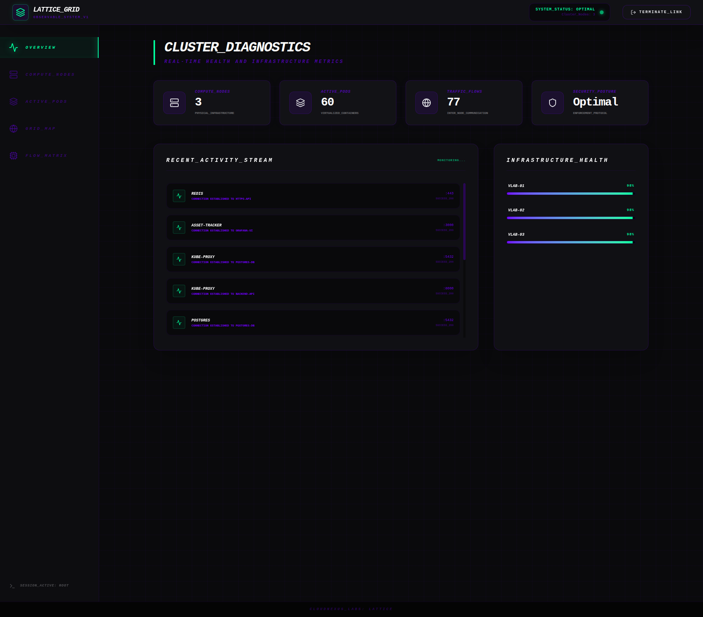
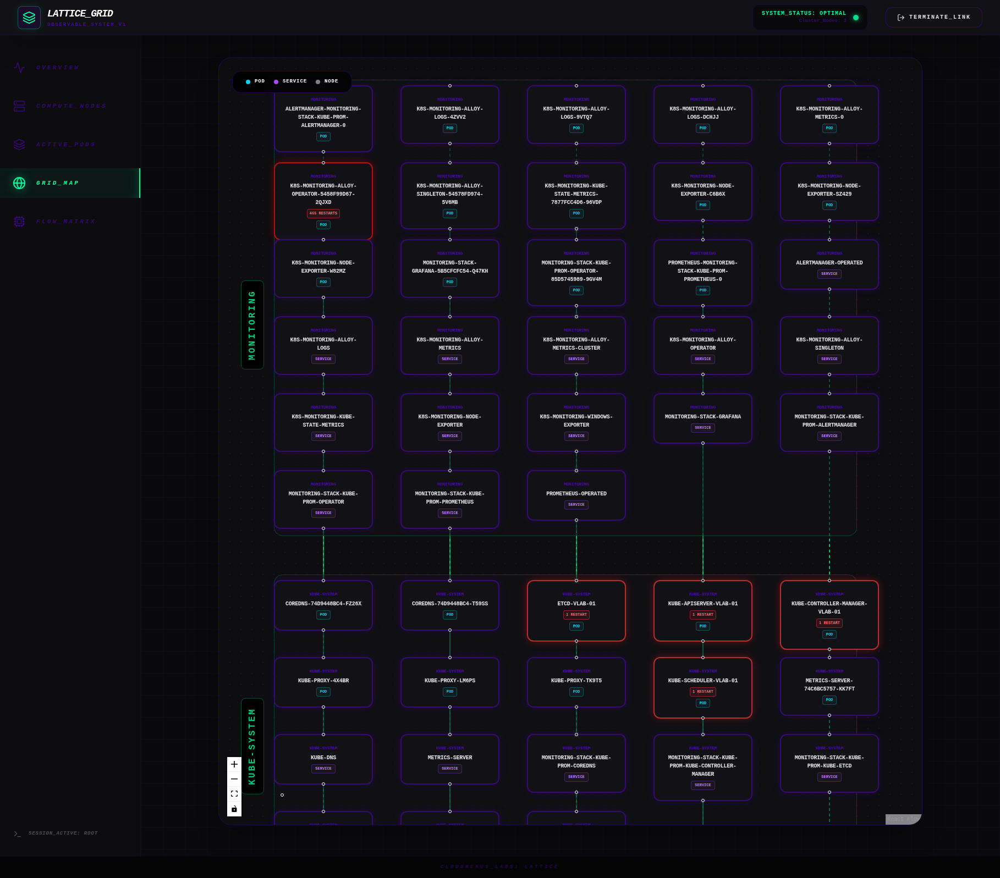
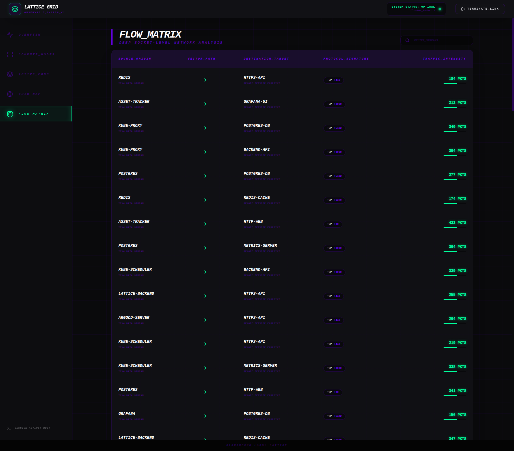

# Lattice - Kubernetes Observability Platform

A modern, scalable Kubernetes observability platform powered by eBPF that provides real-time insights into cluster health, network flows, and pod status.



## Features

### Grid Map (Topology View)
Visual representation of your Kubernetes cluster with:
- **Namespace-based grouping** - Pods organized by namespace for easy navigation
- **Pod restart detection** - Pods with high restart counts are highlighted with red/orange borders and "X RESTARTS" badges
- **Node mapping** - Visual connections showing which pods run on which nodes
- **Service awareness** - Different visual styling for pods vs services vs nodes



### Flow Matrix
Deep socket-level network analysis with:
- Real-time traffic flow monitoring
- Source and destination visualization
- Protocol and port tracking
- Traffic intensity metrics (packet counts)



### Overview Dashboard
- Cluster node count and health status
- Active pod statistics
- Traffic flow summary
- Recent activity stream
- Infrastructure health indicators

## Architecture

```
┌─────────────────────────────────────────────────────────────┐
│                     React Frontend                           │
│                   (lattice-frontend)                        │
│              Port 80 (nginx)                                 │
└─────────────────────┬───────────────────────────────────────┘
                      │ API
                      ▼
┌─────────────────────────────────────────────────────────────┐
│                   FastAPI Backend                           │
│                    (lattice-backend)                        │
│                     Port 8000                               │
│  ┌──────────────┬──────────────┬──────────────────────┐    │
│  │   Auth       │  K8s API     │   PostgreSQL         │    │
│  │   (JWT)      │  (cluster)   │   (metrics storage)  │    │
│  └──────────────┴──────────────┴──────────────────────┘    │
└─────────────────────┬───────────────────────────────────────┘
                      │
      ┌───────────────┼───────────────┐
      ▼               ▼               ▼
┌─────────────┐ ┌─────────────┐ ┌─────────────┐
│ Kubernetes  │ │ PostgreSQL  │ │   eBPF      │
│   API       │ │  Database   │ │   Agent     │
│  (cluster)  │ │ (lattice-db)│ │(DaemonSet)  │
└─────────────┘ └─────────────┘ └─────────────┘
```

## Components

| Component | Description |
|-----------|-------------|
| **lattice-frontend** | React application with cyberpunk UI |
| **lattice-backend** | FastAPI server providing REST API |
| **lattice-db** | PostgreSQL for metric storage |
| **lattice-agent** | eBPF-based network monitoring (DaemonSet) |

## Deployment

Deploy the entire stack to the `lattice` namespace:

```bash
# Using the included Helm chart
helm install lattice ./helm/lattice --namespace lattice --create-namespace

# Or use the convenience script
./helm/install.sh
```

### Prerequisites

- Kubernetes cluster (1.20+)
- Helm 3.x
- Images pushed to your registry (update values in `helm/lattice/values.yaml`)

### Configuration

Key values in `helm/lattice/values.yaml`:

```yaml
image:
  registry: 192.168.1.20:5000
  backend: lattice-backend:latest
  frontend: lattice-frontend:latest
  agent: lattice-agent:latest

backend:
  adminPassword: "change-me-admin"  # Initial admin password

namespace: lattice
```

### Access the Dashboard

```bash
kubectl port-forward svc/lattice-frontend 8080:80 -n lattice
```

Then open http://localhost:8080 in your browser.

**Default credentials:**
- Username: `admin`
- Password: `change-me-admin` (or from K8s Secret `initial-admin-secret`)

## API Endpoints

| Endpoint | Method | Description |
|----------|--------|-------------|
| `/token` | POST | Authenticate and get JWT token |
| `/topology` | GET | Get cluster topology (pods, services, nodes) |
| `/flows` | GET | Get network flow data |
| `/metrics` | GET | Get collected metrics |

## Restart Detection

The Grid Map automatically highlights pods with container restarts:

- **Red border intensity** scales with restart count
- **"X RESTARTS" badge** displays on affected pods
- Restarts are fetched from Kubernetes container status metrics

This helps operators quickly identify:
- Crashing applications
- Misconfigured pods
- Resource constraint issues
- Graceful rolling updates

## Tech Stack

- **Frontend**: React 18, Tailwind CSS, React Flow, Vite
- **Backend**: Python FastAPI, JWT authentication, Kubernetes client
- **Database**: PostgreSQL
- **Agent**: Python eBPF for network monitoring
- **Deployment**: Helm charts

## Project Structure

```
lattice/
├── agent/           # eBPF agent code
├── backend/         # FastAPI backend
│   └── main.py      # Main application
├── frontend/         # React frontend
│   └── src/
│       └── App.jsx  # Main React component
├── helm/            # Helm charts
│   └── lattice/     # Lattice Helm chart
└── docs/
    └── screenshots/  # Documentation screenshots
```
